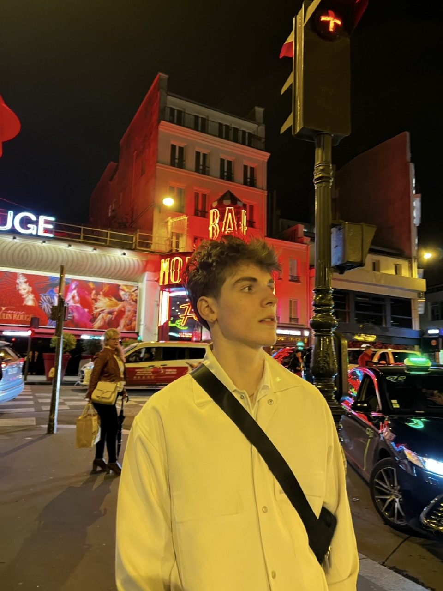

Howdy, welcome to my site! My name is Victor and I am an [Engineering Science](https://www.sfu.ca/engineering/prospective-students/undergraduate-students/programs.html) student at Simon Fraser University in Burnaby, BC.

I love working with software as well as hardware, and thoroughly enjoy tinkering with new and engaging things (like this website!)

Outside of school and personal projects, I am passionate about weightlifting, skiing, and spending time with the people I care about. I am always chasing new experiences, so check back here often!

- [projects](about/projects.md) i (and my teammates) have built;

<figure>
	
	</figcaption>
</figure>